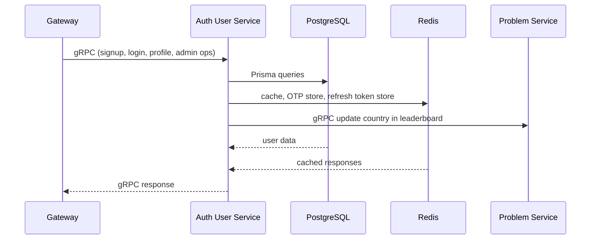

# Codex Auth User Service

The Auth User Service is the identity, authentication, and profile-management backbone of the Codex platform. It handles user lifecycle, security flows, admin user operations, caching, token issuance, and communicates with Problem Service to update leaderboard-related user context. Built using Clean Architecture principles, it maintains strict separation of concerns and uses gRPC for all transport.

---

## 1. Service Overview

The service owns all user-specific logic for Codex:

* Signup, login, OAuth, OTP verification
* Access and refresh token generation (JWT)
* Password reset and change-password flows
* User profile update, email change, email verification
* Admin capabilities: list users, block/unblock, fetch analytics
* Caching (Redis) to reduce DB load
* gRPC server + gRPC client call to Problem Service
* Clean Architecture enforced through entities, use cases, and handlers
* OpenTelemetry tracing for gRPC, PostgreSQL, and Redis
* Prisma ORM with PostgreSQL (Supabase)

---

## 2. High-Level Architecture

```
Client → gRPC Gateway
       → Auth User gRPC Server
       → Handler (User/Admin/Common)
       → UseCase layer
       → Domain entity/value objects
       → Repository (Prisma)
       → Redis cache / Problem Service gRPC Client
       → Response
```

---

## 3. Responsibilities

### Core Responsibilities

* Authentication (local and OAuth)
* OTP generation and verification
* Token lifecycle (access, refresh)
* Profile and account management
* Admin views: users, stats, block states
* Email workflows (verification, password reset)
* Inter-service update to Problem Service (update country in leaderboard)
* Caching for performance

### Not Responsible For

* HTTP routing (Gateway handles this)
* Problem, submission, leaderboard logic
* File storage or code execution

---

## 4. Tech Stack

* **Node.js + TypeScript**
* **gRPC server & client**
* **Prisma ORM + PostgreSQL (Supabase)**
* **Redis** for cache and OTP invalidation
* **InversifyJS** for dependency injection
* **OpenTelemetry** for distributed tracing
* **Pino logger** for structured logging
* **Clean Architecture + SOLID principles**

---

## 5. Folder Structure (Simplified)

```
src/
  app/
    providers/       # Otp, tokens, password hashing, cache
    useCases/        # admin + user + authentication flows
  config/            # env, redis, tracing, DI container
  domain/            # entities, value objects, enums, DTOs
  infra/             # repository + grpc clients
  presentation/grpc/ # server + handlers
  utils/             # logger, status mapper, helpers
index.ts             # service bootstrap
```

---

## 6. gRPC Architecture



---

## 7. Major Components

### Authentication

* Local login with hashed passwords
* OAuth login (Google)
* OTP-based signup verification and password reset

### Token System

* Access token (short-lived)
* Refresh token (long-lived)
* Token payload built from domain entity
* Token versioning via tokenId

### User Management

* Update profile, change email, change password
* Soft delete account
* Update progress (called by Problem Service)

### Admin Features

* Block/unblock users
* List users with filters
* Fetch user statistics

### Inter-Service Communication

* gRPC client to Problem Service
* Used for updating leaderboard country when user updates profile

### Caching Layer

Caches:

* OTP throttling
* Profile snapshots
* Refresh token stores

---

## 8. Observability

### Tracing

* gRPC server spans
* Prisma (PostgreSQL) spans
* Redis spans

### Logging

* Structured Pino logs
* Includes email, userId, role, and use case names

### Metrics

* Custom gRPC middleware collects latency, RPS, error rates

---

## 9. CI/CD Pipeline

```mermaid
flowchart LR
    DevPush[Push to dev/feature] --> GH[GitHub Actions]
    GH --> Lint[Lint + Type Check]
    Lint --> TestBuild[Test Build]
    TestBuild -->|Merge to main| BuildProd[Build Production Image]
    BuildProd --> DockerHub[Push to Docker Hub]
    DockerHub --> Argo[ArgoCD Image Updater]
    Argo --> GKE[GKE Rolling Update]
```



### Summary

* Feature/dev push triggers lightweight verification build
* Merge to main builds and pushes production image
* ArgoCD Image Updater detects new tag on Docker Hub
* GKE applies rolling updates

---

## 10. Local Development

Install dependencies:

```
npm install
```

Run locally:

```
npm run dev
```

Generate Prisma client:

```
npx prisma generate
```

Run migrations:

```
npx prisma migrate dev
```

Docker build:

```
docker build -t codex-auth-user-service .
```

---

## 11. License

MIT
